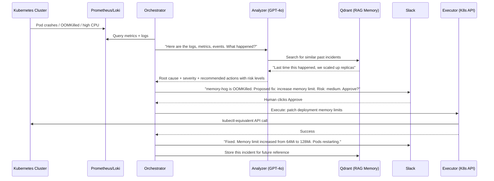

## What Argus Actually Does

Argus is an **autonomous Kubernetes incident responder**. It sits inside your cluster, watches for things breaking, figures out why, and fixes them, with or without your approval depending on how dangerous the fix is.

Here is the actual pipeline, step by step, based on the LangGraph orchestrator in your codebase:

## The Specific Actions It Can Perform

These are the real actions registered in `backend/modules/execution/actions/registry.py`:

- **restart_pods** -- Triggers a rolling restart by patching the deployment's `restartedAt` annotation. Useful when a pod is stuck in a bad state but the deployment spec is fine.
- **rollback** -- Finds the previous ReplicaSet template and patches the deployment to revert. This is what you'd normally do with `kubectl rollout undo`, but done programmatically via the Python K8s API.
- **scale** -- Changes the replica count on a deployment. Useful for both scaling up (handle load) and scaling down (stop a broken replica from consuming resources).
- **notify_oncall** -- Posts a structured Slack message when the issue needs human judgment rather than automated remediation.

Each action has a **risk level** (none, low, medium, high). The agent's approval logic:
- none/low/medium: auto-executes immediately
- high: pauses the entire LangGraph workflow using `interrupt()`, sends an interactive Slack message with Approve/Reject buttons, and resumes only when a human responds

## Why Someone Would Actually Need This

The problem isn't "I want AI for my cluster." The problem is concrete:

**1. The 3 AM OOMKill page**

Your `memory-hog` test case is a real scenario. A pod starts eating memory, gets OOMKilled, Kubernetes restarts it, it eats memory again, gets killed again. Without Argus, a human gets paged, opens their laptop, runs `kubectl describe pod`, reads the events, sees "OOMKilled", edits the deployment YAML, applies it, watches the rollout. That's 15-30 minutes at 3 AM. With Argus, the agent detects the OOMKill from Prometheus metrics, reads the logs from Loki, determines the fix is to increase the memory limit, and either does it automatically or sends you a single "Approve" button on Slack. Done in under 2 minutes.

**2. The "what changed?" rollback problem**

Someone deploys a bad image. Pods start crash-looping. The person who deployed it is offline. Another engineer gets paged but doesn't know what changed. They have to dig through deployment history, find the previous working revision, and roll back. Argus does this automatically -- it inspects ReplicaSets, identifies the previous stable template, and patches the deployment.

**3. Incident amnesia**

Team fixes the same class of issue every few months but nobody remembers the fix. Argus stores every resolved incident in Qdrant as vector embeddings. Next time a similar issue happens, the analyzer pulls up: "Last time this service OOMKilled, we increased limits from 64Mi to 128Mi and that resolved it." The LLM uses that context to propose the same proven fix rather than guessing.

**4. Reducing mean-time-to-resolution (MTTR) for known patterns**

Most production incidents fall into a handful of categories: OOMKill, CrashLoopBackOff, stuck deployments, resource exhaustion. These have well-known fixes. Argus handles them in seconds instead of waiting for a human to context-switch, SSH in, diagnose, and fix.

## What It Does NOT Do

Being specific also means being honest about limits:

- It **cannot fix code bugs**. The `crash-simulator` proved this -- the app crashes because of a hardcoded `exit 1`. No amount of restarting or rolling back fixes that. Argus correctly identifies it and escalates to Slack rather than pretending it can fix it.
- It **does not replace monitoring dashboards**. It consumes Prometheus/Loki data but doesn't replace Grafana for visualization.
- It **does not handle complex multi-service failures** (e.g., cascading failures across 10 microservices). It operates per-incident, per-workload.
- It **requires Prometheus and Loki already running**. It doesn't bring its own metrics collection; it queries existing infrastructure (which the Helm chart deploys).

## The Real Value Proposition

The honest pitch is: **Argus turns a 20-minute human incident response into a 2-minute automated one for the 80% of incidents that have standard fixes**, and for the other 20%, it still does the diagnosis work and hands you a root cause analysis with context so you start from "here's what's wrong and here's what might fix it" instead of "something is broken somewhere."
